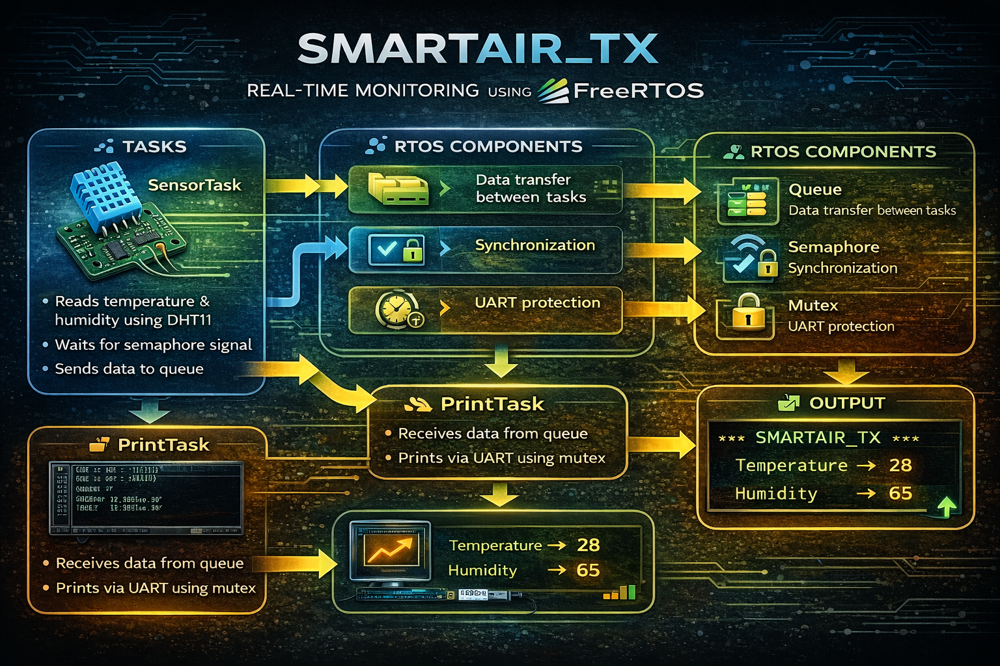

# 🌡️ SmartAir_TX – Real-Time Monitoring using Embedded C & FreeRTOS

  

  ⚙️ FreeRTOS • Real-Time Monitoring • Embedded C • Sensor-Based System

---

## 📌 Overview

**SmartAir_TX** is a real-time embedded system developed using **Embedded C and FreeRTOS** to monitor environmental conditions such as **temperature and humidity**.

The system uses a **DHT11 sensor** to collect data and processes it using multiple FreeRTOS tasks. It demonstrates efficient **task scheduling, inter-task communication, and synchronization mechanisms** such as queues, semaphores, and mutexes.

The project reflects how modern embedded systems handle **real-time sensor data processing and safe resource sharing** in multitasking environments.

---

## 🎯 Objective

- Implement real-time monitoring using FreeRTOS  
- Acquire sensor data (temperature & humidity)  
- Demonstrate inter-task communication using queues  
- Implement synchronization using semaphores  
- Ensure safe UART communication using mutex  
- Build a reliable and scalable embedded system  

---

## ⚙️ System Architecture

DHT11 Sensor → SensorTask → Queue → PrintTask → UART Output
↑
Semaphore
↑
Timer

---

## 🔄 Working Principle

1. **Timer triggers every 3 seconds**  
2. Timer gives a **semaphore signal**  
3. **SensorTask**:
   - Waits for semaphore  
   - Reads temperature & humidity from DHT11  
   - Sends data to queue  
4. **PrintTask**:
   - Receives data from queue  
   - Uses mutex to access UART safely  
   - Prints output  
5. System repeats continuously  

---

## 🧩 FreeRTOS Task Design

### 🔹 SensorTask
- Reads data from DHT11 sensor  
- Waits for semaphore signal  
- Sends structured data to queue  

### 🔹 PrintTask
- Receives data from queue  
- Uses mutex for safe UART access  
- Displays output  

---

## 🔧 RTOS Components Used

| Component   | Purpose |
|------------|--------|
| **Queue**   | Data transfer between tasks |
| **Semaphore** | Synchronization between timer and SensorTask |
| **Mutex**   | Protect UART resource |
| **Timer**   | Triggers task periodically (3 seconds) |

---

## ✨ Key Features

- 📊 Real-time temperature & humidity monitoring  
- ⚙️ FreeRTOS-based multitasking  
- 🔄 Efficient inter-task communication  
- 🔐 Safe resource sharing using mutex  
- ⏱️ Periodic task execution using timer  
- 🧠 Scalable embedded system design  

---

## 🛠️ Technologies Used

- **Programming Language:** C  
- **RTOS:** FreeRTOS  
- **Sensor:** DHT11  
- **Concepts:**
  - Task Scheduling  
  - Inter-task Communication  
  - Synchronization  
  - Embedded Systems  

---

## 📂 Project Structure

SmartAir_TX/
│
├── main.c # Entry point
├── sensor_task.c # Sensor task logic
├── print_task.c # UART print task
├── dht11.c # DHT11 driver
├── rtos_config.h # FreeRTOS configuration
├── queue.c # Queue handling
├── semaphore.c # Synchronization logic
├── mutex.c # Resource protection
└── README.md # Documentation

---

## 📊 Output

Temperature -> 28
Humidity -> 65

---

## 🔧 Skills

- Embedded C  
- FreeRTOS  
- Task Scheduling  
- Inter-task Communication  
- Synchronization (Mutex, Semaphore)  
- Sensor Interfacing (DHT11)  
- UART Communication

---

## 💡 Applications

- Smart home systems  
- Environmental monitoring  
- Industrial automation  
- IoT sensor systems  
- Weather monitoring systems  

---

## ⚠️ Limitations

- Uses DHT11 (limited accuracy)  
- CLI-based output only  
- No cloud integration  
- Single sensor system  

---

## 📌 Conclusion

This project demonstrates how **FreeRTOS enables real-time data processing and efficient task management** in embedded systems.

By using **queues, semaphores, mutexes, and timers**, the system ensures:
- Reliable communication  
- Safe resource sharing  
- Predictable behavior  

It provides strong hands-on experience in designing **real-time, multitasking embedded applications**, which are widely used in IoT and industrial systems. 

---
